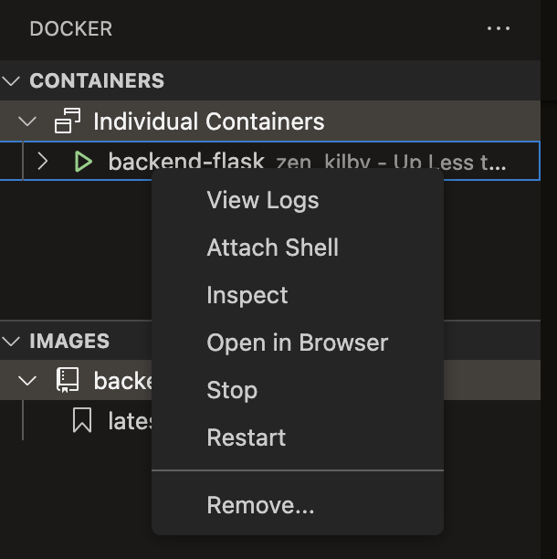

# Week 1 — App Containerization

## Build the docker image for backend.
```bash
docker build -t  backend-flask ./backend-flask
```
## Run the backend image.
To run the docker image and set the envrionment variable
```bash
docker run --rm -p 4567:4567 -it -e FRONTEND_URL='*' -e BACKEND_URL='*' backend-flask
```
## Build Container for the frontend
```bash
docker build -t frontend-react-js ./frontend-react-js
```

## Why containerisation?
1. Reduce time to set up the environment.
2. Node version or Python version, compilers, these can be different. It can be time consuming to figure out what's causing the different behaviour.


## How long does it take to master docker?

James: Referring to [linuxserver](www.linuxserver.io), and learn from these. Referring to OCI (Open container initiative) for best practice on building an image.

## Setting both frontend_url and backend_url
enter both line into terminal.
```bash
export FRONTEND_URL="*"
export BACKEND_URL="*"
```

## Containerize backend

cd into `backend-flask` and create a new file `Dockerfile`

From the images in the dockerhub, following the `FROM` each image are comprises of different layer of other images.
```Dockerfile
FROM python:3.10-slim-buster 
```
In the `Dockerfile`, you will see this `CMD [ "python3", "-m" , "flask", "run", "--host=0.0.0.0", "--port=4567"]` and it is actually the equivalent of the below. 

```bash
python3 -m flask run --host=0.0.0.0 --port=4567
```
```bash
docker build -t  backend-flask ./backend-flask
```
```bash
docker run --rm -p 4567:4567 -it -e FRONTEND_URL='*' -e BACKEND_URL='*' backend-flask
```

The command python3 -m flask run --host=0.0.0.0 --port=4567 is used to run a Flask application. Here's what each argument does:

- `python3`: This specifies the Python version to use for running the Flask application.
- `-m flask`: This tells Python to run the Flask module.
- `run`: This is the command to run the Flask application.
- `--host`=0.0.0.0: This specifies the host IP address, in this case "0.0.0.0". By using this IP address, the Flask application will be accessible from any network interface.
- `--port`=4567: This specifies the port number, in this case "4567", on which the Flask application will listen for incoming requests.

When you run this command, Flask starts a local development server that serves your application on the specified host and port. You can access the Flask application by opening a web browser and navigating to the host IP and port combination (e.g., http://0.0.0.0:4567).

unlock the port in the `PORTS` tab , just beside `TERMINAL`
add `/api/activities/home`, at the end of the url.

you should get the following:
```json
[{"created_at":"2024-01-12T14:07:21.157589+00:00","expires_at":"2024-01-19T14:07:21.157589+00:00","handle":"Andrew Brown","likes_count":5,"message":"Cloud is fun!","replies":[{"created_at":"2024-01-12T14:07:21.157589+00:00","handle":"Worf","likes_count":0,"message":"This post has no honor!","replies_count":0,"reply_to_activity_uuid":"68f126b0-1ceb-4a33-88be-d90fa7109eee","reposts_count":0,"uuid":"26e12864-1c26-5c3a-9658-97a10f8fea67"}],"replies_count":1,"reposts_count":0,"uuid":"68f126b0-1ceb-4a33-88be-d90fa7109eee"},{"created_at":"2024-01-07T14:07:21.157589+00:00","expires_at":"2024-01-23T14:07:21.157589+00:00","handle":"Worf","likes":0,"message":"I am out of prune juice","replies":[],"uuid":"66e12864-8c26-4c3a-9658-95a10f8fea67"},{"created_at":"2024-01-14T13:07:21.157589+00:00","expires_at":"2024-01-15T02:07:21.157589+00:00","handle":"Garek","likes":0,"message":"My dear doctor, I am just simple tailor","replies":[],"uuid":"248959df-3079-4947-b847-9e0892d1bab4"}]
```

To remove the environment variable, do the following:
```bash
unset BACKEND_URL
```
Make sure that you are in the project's home directory and run the following: 

```bash
docker build -t backend-flask ./backend-flask
```

The command `docker build -t backend-flask ./backend-flask` is used to build a Docker image with the tag "backend-flask" from the Dockerfile located in the "./backend-flask" directory.

To run the docker image, 
```bash
docker run --rm -p 4567:4567 -it backend-flask
```
This run a Docker container with the name "backend-flask" and expose port 4567 on both the host and container. The "--rm"The given command is used to run a Docker container with the following configuration:
	•	It will remove the container (--rm) after it stops running.
	•	The container's port 4567 will be mapped to the host's port 4566 (-p 4566:4567).
	•	It will be run in interactive mode (-it).
	•	The FRONTEND_URL environment variable will be set to '' (-e FRONTEND_URL='').
	•	The BACKEND_URL environment variable will be set to '' (-e BACKEND_URL='').
	•	The container will use the backend-flask image to run.
Is there anything specific you would like to know about this command? flag ensures that the container is automatically removed after it exits, and the "-it" flag allocates a pseudo-TTY for interactive communication.

To help in debug, you can run the container, and right click to select `attach shell`


add `/api/activities/home`, at the end of the url.

## Build Container for the frontend
```bash
docker build -t frontend-react-js ./frontend-react-js
```